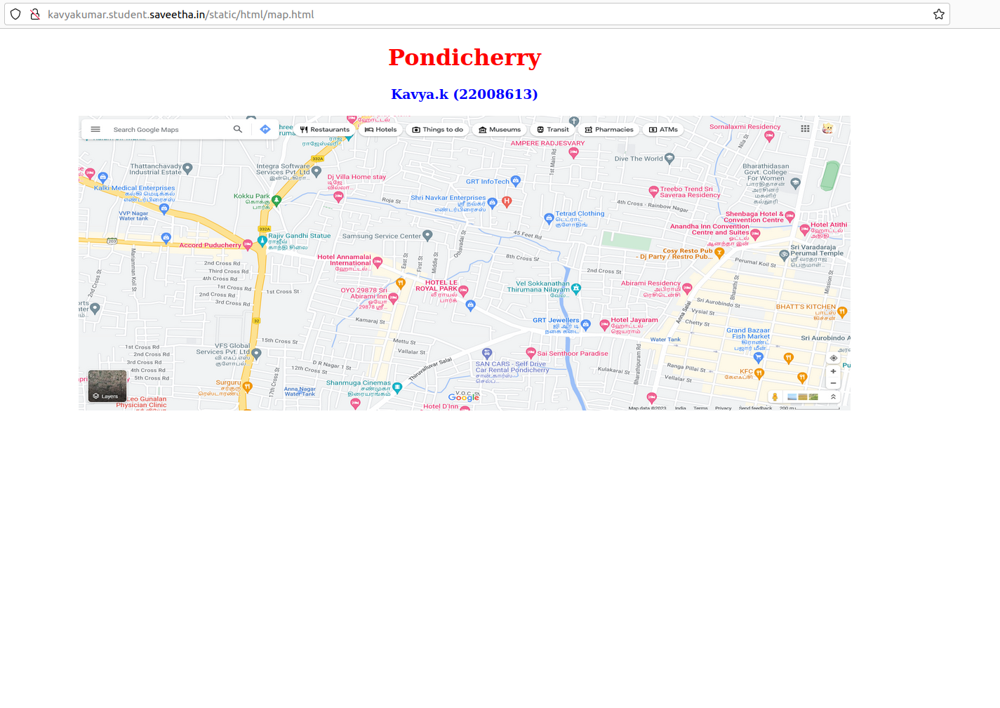
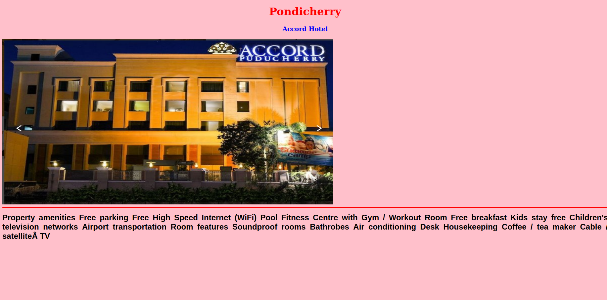
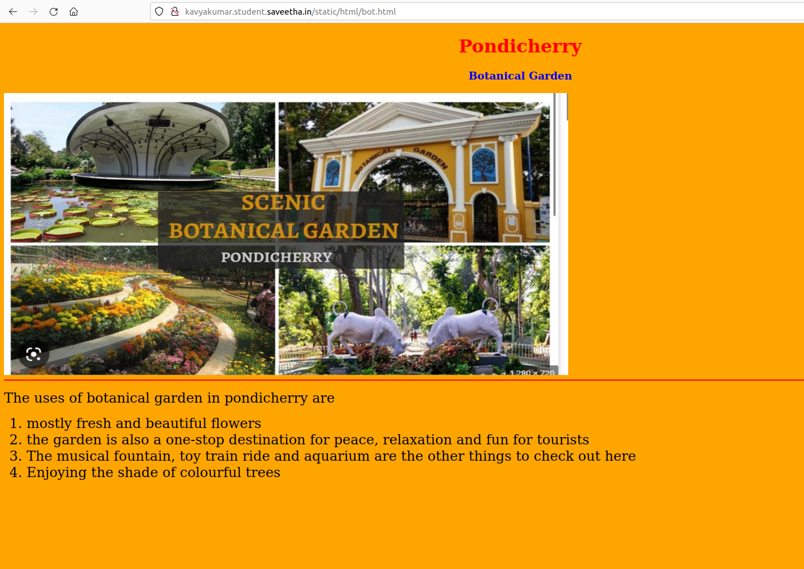
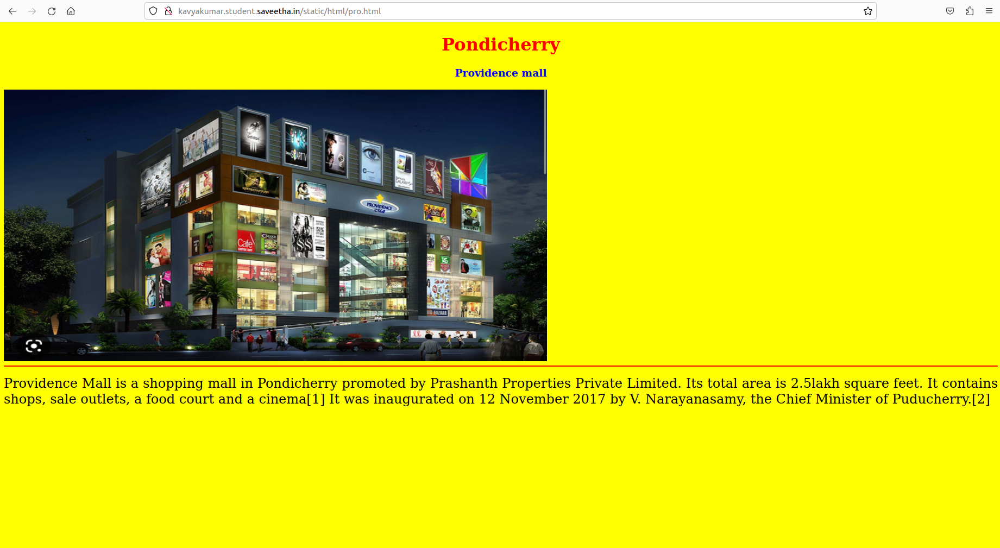
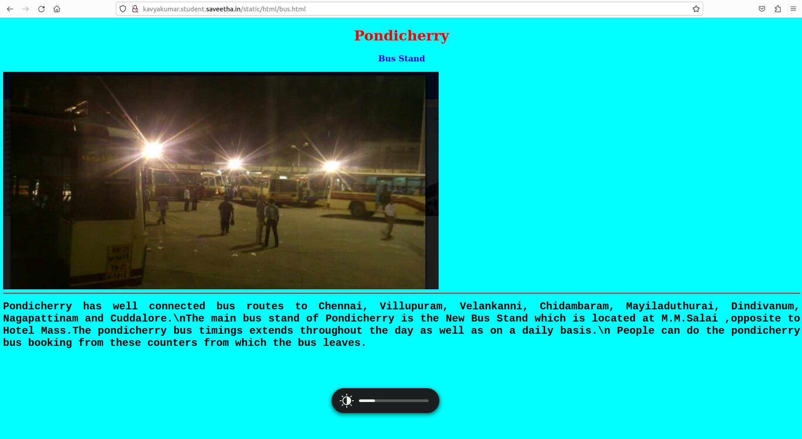
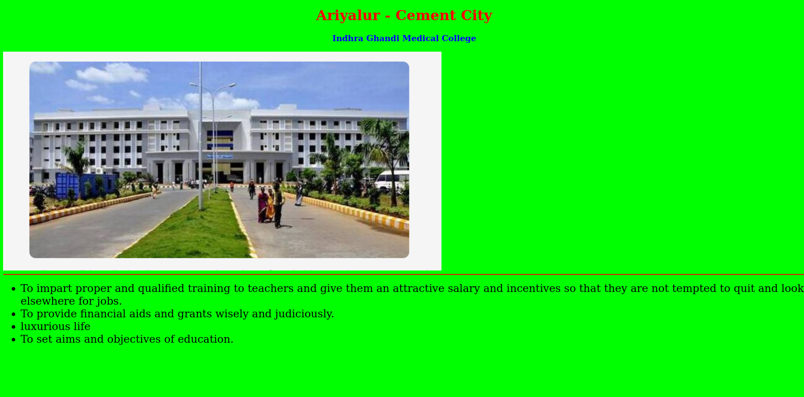

# Places Around Me
## AIM:
To develop a website to display details about the places around my house.
## Design Steps:

Step 1: Create a new django project and app

Step 2: Add a new imagemap html file in templates and neede images in static folder and define it in settings.

Step 3: Type ur image map code in the html with coordinates and target file to redirect on click

Step 4: Define your components pages and create content in such a way that it gives information about place which is being clicked

Step 5: Include pictures and contents for your subpages and map them using urls and views


## Code:
```python
map.html
<!DOCTYPE html>
<html lang="en">
<head>
<title>MY AREA</title>
</head>
<body>
<h1 align="center">
<font color="red"><b>Pondicherry</b></font>
</h1>
<h3 align="center">
<font color="blue"><b>Kavya.k (22008613)</b></font>
</h3>
<center>

<map name="MyCity">
<area shape="circle" coords="190,50,20" href="/static/html/acc.html" title="Accord hotel">
<area shape="rectangle" coords="230,30,260,60" href="/static/html/bot.html" title="Botanical Garden">
<area shape="circle" coords="400,350,50" href="/static/html/bus.html" title="Bustand">
<area shape="circle" coords="400,200,75" href="/static/html/med.html" title="Indhra Ghandi Medical College">
<area shape="rectangle" coords="490,150,870,320" href="/static/html/pro.html" title="Providence mall">
</map>
</center>
</body>
</html>
acc.html
<!DOCTYPE html>
<html lang="en">
<head>
<title>Accord Hotel</title>
</head>
<body bgcolor="pink">
<h1 align="center">
<font color="red"><b>Pondicherry</b></font>
</h1>
<h3 align="center">
<font color="blue"><b>Accord Hotel</b></font>
</h3>

<hr size="3" color="red">
<p align="justify">
<font face="Arial" size="5">
<b>
    Property amenities
Free parking
Free High Speed Internet (WiFi)
Pool
Fitness Centre with Gym / Workout Room
Free breakfast
Kids stay free
Children's television networks
Airport transportation

Room features

Soundproof rooms
Bathrobes
Air conditioning
Desk
Housekeeping
Coffee / tea maker
Cable / satellite TV

</b>
</font>
</p>
</body>
</html>

bot.html
<!DOCTYPE html>
<html lang="en">
<head>
<title>Botanical Garden</title>
</head>
<body bgcolor="orange">
<h1 align="center">
<font color="red"><b>Pondicherry</b></font>
</h1>
<h3 align="center">
<font color="blue"><b>Botanical Garden</b></font>

</h3>

<hr size="3" color="red">
<p align="justify">
<font face="Georgia" size="5">
The uses of botanical garden in pondicherry  are 
<ol type="1">
<li>mostly fresh and beautiful flowers </li>
<li>the garden is also a one-stop destination for peace, relaxation and fun for tourists</li>
<li>The musical fountain, toy train ride and aquarium are the other things to check out here</li>
<li> Enjoying the shade of colourful trees</li>
</ol>
</font>
</p>
</body>
</html>

med.html
<!DOCTYPE html>
<html lang="en">
<head>
<title>Indhra Ghandi Medical College</title>
</head>
<body bgcolor="lime">
<h1 align="center">
<font color="red"><b>Ariyalur - Cement City</b></font>
</h1>
<h3 align="center">
<font color="blue"><b>Indhra Ghandi Medical College</b></font>
</h3>

<hr size="3" color="red">
<p align="justify">
<font face="Georgia" size="5">

<ul>
<li>To impart proper and qualified training to teachers and give them an attractive salary and incentives so that they are not tempted to quit and look elsewhere for jobs.</li>
<li>To provide financial aids and grants wisely and judiciously.</li>
<li>luxurious life</li>
<li>To set aims and objectives of education.</li>
</ul>
</font>
</p>
</body>
</html>
pro.html
<!DOCTYPE html>
<html lang="en">
<head>
<title>Providence mall</title>
</head>
<body bgcolor="yellow">
<h1 align="center">
<font color="red"><b>Pondicherry</b></font>
</h1>
<h3 align="center">
<font color="blue"><b>Providence mall</b></font>
</h3>

<hr size="3" color="red">
<p align="justify">
<font face="Tahoma" size="5">
Providence Mall is a shopping mall in Pondicherry promoted by Prashanth Properties Private Limited. Its total area is 2.5lakh square feet. It contains shops, sale outlets, a food court and a cinema[1] It was inaugurated on 12 November 2017 by V. Narayanasamy, the Chief Minister of Puducherry.[2] 
</font>
</p>
</body>
</html>

bus.html

<!DOCTYPE html>
<html lang="en">
<head>
<title>Bus Stand</title>
</head>
<body bgcolor="cyan">
<h1 align="center">
<font color="red"><b>Pondicherry</b></font>
</h1>
<h3 align="center">
<font color="blue"><b> Bus Stand</b></font>
</h3>

<hr size="3" color="red">
<p align="justify">
<font face="Courier New" size="5">
<b>
Pondicherry has well connected bus routes to Chennai, Villupuram, Velankanni, Chidambaram, Mayiladuthurai, Dindivanum, Nagapattinam and Cuddalore.\nThe main bus stand of Pondicherry is the New Bus Stand which is located at M.M.Salai ,opposite to Hotel Mass.The pondicherry bus timings extends throughout the day as well as on a daily basis.\n People can do the pondicherry bus booking from these counters from which the bus leaves.
</b>
</font>
</p>
</body>
</html>
```


## Output:








## Result:
Thus a website is developed to display details about the places around my house